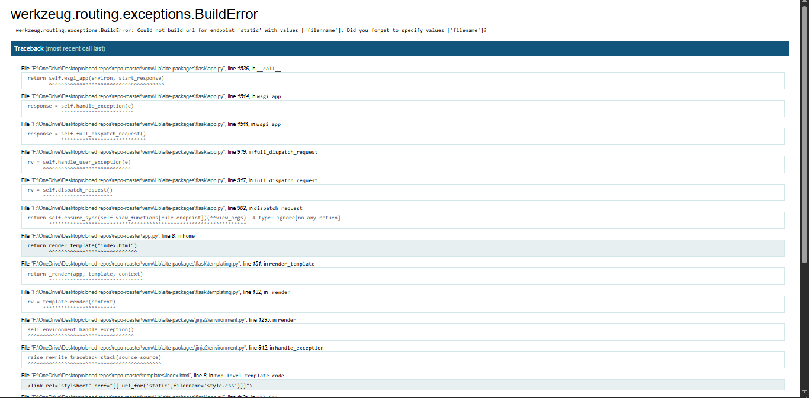

yooo was upp

today is 16/7/2026

i am making a webapp that will roste u like hell, on ur repos

i have made tye files now making the virtual env.

the virtual env is now set. now i haev to install the needed libs and pakages

i am done with all packages and everthing , i needed now gonna build. 

just tested everything is working very well now

something happed

=======

something is not going well

i did it

ohh my yessssssss

i am learning

i was coding and tesing and suddenly hit the the wall of api limit reached.so now gonna make own api, that will be mroe relibal.

i am dumb i am not gonna make a new api but will be using PAT.
got the api, i hope now i dont have to take care for apis.

i have fixed the part of code that were not respondiong. i hope the will work and gonna test 10-15 repos.

oky so the all repos are woking fine and the data is getting fetched.

made the .env to store the API keys.

ohh my yess it working yyayayyayyayayayayyayayayyayayay
